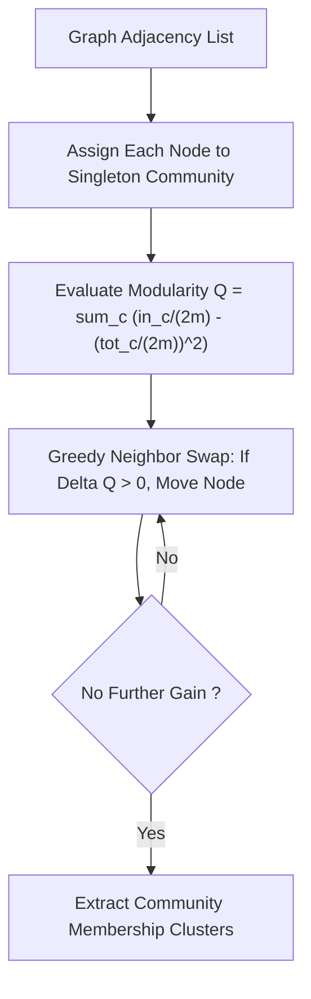

# genpark-louvain-modularity-community-detection-skill

Agent Skill implementing the **Louvain Method for Community Detection** through local modularity optimization and partition extraction.

## Architectural Overview

